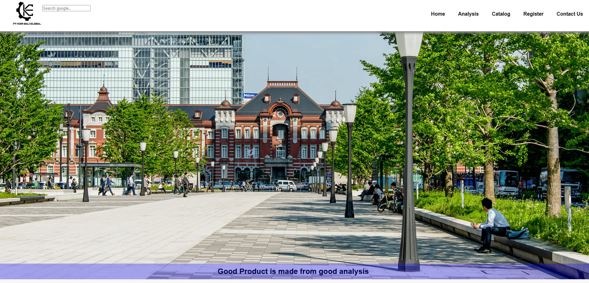

# This is the assignment of week 1
***
# Description
Welcome to our project! This is a koribali website. The website include information regarding to Pole structure
***

# Contributing
We welcome any and all contributions! Here are some ways you can get started:
1. join for engineering club
2. study about safety side of structure
3. analyse a structure of pole

# Skill contain in web:
1. Able to use HTML tags and their proper usage
2. creating a form set that includes input type text, textarea, submit button, and one of the radio buttons, 
3. creating readme.md file

# This is the web sample

# You can go to our sample web:
([https://stately-dieffenbachia-5fce26.netlify.app/])(https://stately-dieffenbachia-5fce26.netlify.app/)